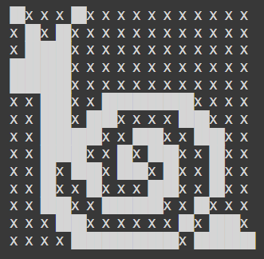

# Solver Nonogram

Nonograms, also known as Hanjie, Paint by Numbers, Picross, Griddlers, and Pic-a-Pix, and by various other names, are picture logic puzzles in which cells in a grid must be colored or left blank according to numbers at the side of the grid to reveal a hidden picture.

The objective of this project is to find a way to solve every nonogram and to generate new ones.

Everything is inside the notebook.
Enjoy

